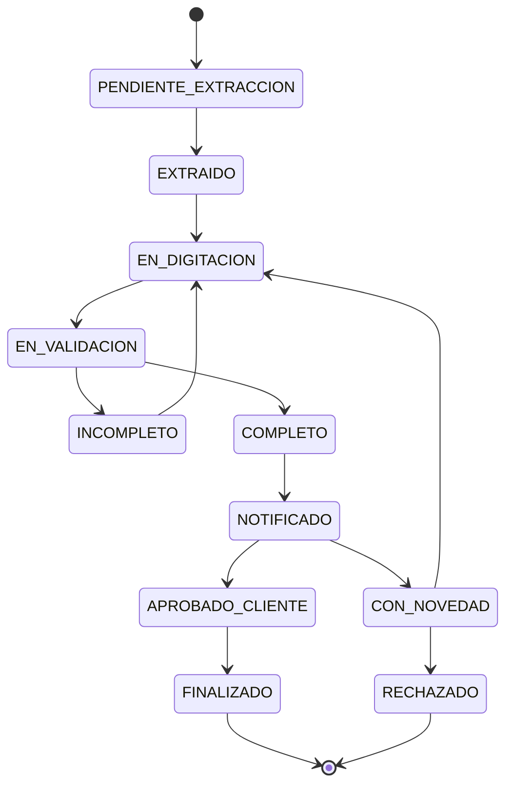

# Shipment State Machine

The shipment documentation workflow is modeled as a **finite state machine**. Each state defines which transitions are legal. Invalid transitions raise `InvalidStateTransitionError`.

## States

| State | Description |
|-------|-------------|
| `PENDIENTE_EXTRACCION` | Shipment created; PDF not yet extracted |
| `EXTRAIDO` | PDF data extracted successfully |
| `EN_DIGITACION` | Operator is entering digitized data |
| `EN_VALIDACION` | Extracted vs digitized data under comparison |
| `INCOMPLETO` | Validation found missing or mismatched fields |
| `COMPLETO` | All fields validated successfully |
| `NOTIFICADO` | Client has been notified |
| `APROBADO_CLIENTE` | Client approved the shipment documentation |
| `CON_NOVEDAD` | A novelty (issue) was registered |
| `FINALIZADO` | Workflow completed successfully |
| `RECHAZADO` | Shipment rejected (terminal) |

## Transition table

| From | To | Trigger / use case |
|------|-----|-------------------|
| `PENDIENTE_EXTRACCION` | `EXTRAIDO` | `ExtractPdfData` completes |
| `EXTRAIDO` | `EN_DIGITACION` | `RegisterDigitizedData` starts |
| `EN_DIGITACION` | `EN_VALIDACION` | Digitization submitted for validation |
| `EN_VALIDACION` | `INCOMPLETO` | `CompareData` finds discrepancies |
| `EN_VALIDACION` | `COMPLETO` | `CompareData` passes |
| `INCOMPLETO` | `EN_DIGITACION` | `CorrectData` — operator fixes fields |
| `COMPLETO` | `NOTIFICADO` | Executive `approve` + email to client |
| `NOTIFICADO` | `APROBADO_CLIENTE` | Client clicks email link (`GET /public/approve`) or `client-approve` API |
| `APROBADO_CLIENTE` | `FINALIZADO` | Automatic on email link; or `finalize` API |
| `NOTIFICADO` | `CON_NOVEDAD` | `RegisterNovelty` |
| `APROBADO_CLIENTE` | `FINALIZADO` | Final closure |
| `CON_NOVEDAD` | `EN_DIGITACION` | Novelty resolved, re-digitization |
| `CON_NOVEDAD` | `RECHAZADO` | Novelty leads to rejection |
| `*` (non-terminal) | `RECHAZADO` | Administrative rejection |

> **Phase 1:** Only `PENDIENTE_EXTRACCION → EXTRAIDO` and `EXTRAIDO → EN_DIGITACION` have concrete `ShipmentState` classes. Remaining states are documented here and will be implemented in Phase 2.

## Diagram

## Implementation reference

- Enum: `app/domain/value_objects/shipment_status.py`
- State pattern: `app/domain/state_machine/shipment_state.py`
- Transition orchestration (stub): `app/application/use_cases/validate_and_transition.py`
